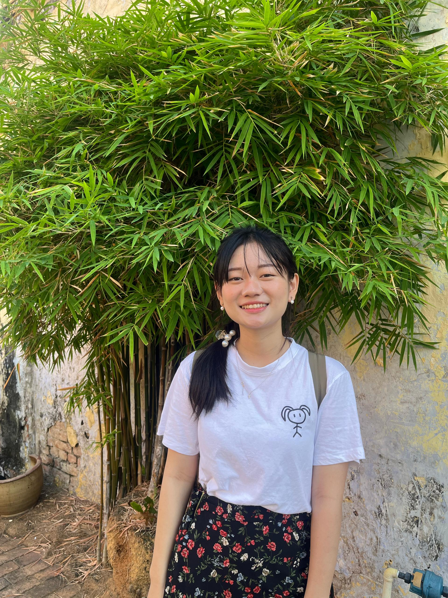

# Introduction
Hi! I'm Tiew Ying Ying, a student in the Framework-Based Software Design and Development course. 
 
Currently, I'm pursuing my Master's in Software Engineering (Software Technology) and working as a Full-time Java Developer.
 
I hope to gain deeper insights into software design, and collaborate with more like-minded developers.

---
## About me
MBTI: ENFJ🔥

- Full-time Java Developer 👩🏻‍💻
- Full-time studying Master in Software Engineering Student 👩🏻‍🎓
- Part-time serving in church ⛪
- Part-time tuition teacher 👩🏻‍🏫

Exhausted?
Yes, so these are what I do to recharge my energy 😎
- Hang out with friends ✨
- Eattt 🍔 🍗 🍜
- Run/Hike 🏃🏻‍♀️ ⛰️

---

<h3 align="left">Languages and Tools</h3>

![Python][Python.com]
![Java][Java.com]
![MySQL][MySQL.com]
![DB2][DB2.com]
![SpringBoot][SprintBoot.com]

## GitHub Profile

You can view my personalized GitHub profile [![GitHub][Github.com]](https://github.com/TiewY)

[Java.com]:https://img.shields.io/badge/Java-ED8B00?style=for-the-badge&logo=openjdk&logoColor=white
[Python.com]:https://img.shields.io/badge/python-3670A0?style=for-the-badge&logo=python&logoColor=ffdd54
[MySQL.com]:https://img.shields.io/badge/MySQL-4479A1?style=for-the-badge&logo=mysql&logoColor=white
[DB2.com]:https://img.shields.io/badge/IBMDB2-008000?logo=IBMDB2&logoColor=fff&style=for-the-badge
[SpringBoot.com]:https://img.shields.io/badge/spring-%236DB33F.svg?style=for-the-badge&logo=spring&logoColor=white
